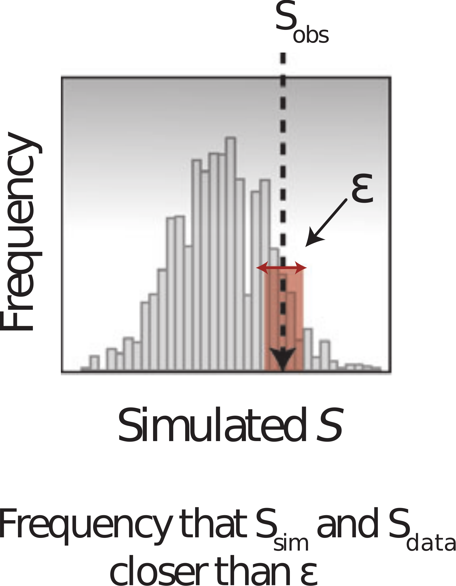

# Inference by simulation

## No likelihood you believe in

You have a simulator. What you do not have is a $p(y \mid \theta)$ you would
defend: the counts are not really Poisson, the reporting process is too tangled
to write down, the model is somebody else's black box.

. . .

You can run it, though. As many times as you like.

. . .

What now?

## Draw, simulate, compare

Draw $\theta$ from the prior. Simulate a dataset. Keep $\theta$ if the simulation
came out [exactly equal to the data]{.alert}.

. . .

Nothing has been approximated. The $\theta$ you keep are draws from
$p(\theta \mid y)$.

## Approximate Bayesian Computation {.smaller}

Exact equality has probability zero for anything but tiny discrete data. Nothing
would ever be accepted, so we make two concessions. This is where the
[approximate]{.alert} comes from.

. . .

[**Close, not equal.**]{.alert} Keep $\theta$ when
$d(y_\text{sim},\, y) < \epsilon$. That buys acceptances, and costs you a
tolerance you now have to choose.

. . .

[**Summaries, not the whole dataset.**]{.alert} Over 59 days even "close" almost
never happens. Compare $s(y_\text{sim})$ with $s(y)$ instead.

. . .

Shrinking $\epsilon$ can undo the first. Nothing undoes the second.

## The approximation {.smaller}

$$p(\text{data} \mid \theta) \approx p\big(d(S_\text{data},\, S_{\text{sim}(\theta)}) < \epsilon\big)$$

- $S$: summary statistics
- $d$: distance, e.g. absolute distance
- $\epsilon$: acceptance window

## The approximation, in a picture

{.step .tall}

## Rejection ABC {.smaller}

The simplest version, and the one you will write:

1. Sample $\theta^*$ from the prior
2. Simulate a dataset from the model at $\theta^*$
3. Compute the distance $d$ between simulation and data
4. Keep $\theta^*$ if $d < \epsilon$, otherwise discard it

. . .

Repeat until you have enough samples. The kept parameters approximate the
posterior.

. . .

No likelihood anywhere. Just a simulator, a distance, and a threshold.

## Choosing summary statistics {.smaller}

Three things decide whether a choice is any good.

. . .

[**How many.**]{.alert} Every summary has to land inside $\epsilon$ *at the same
time*, so acceptance falls off geometrically as you add them. That is why people
use three or four.

. . .

[**Whether they move with $\theta$.**]{.alert} A summary that barely responds to
the parameters shrinks the acceptance region and tells you nothing. Ideally each
one pins down a different parameter.

. . .

[**What scale they are on.**]{.alert} A total in the hundreds and a peak day in
the tens are not comparable. Weight each by its spread under the prior
predictive, or the largest summary becomes the only one that counts.

## What you are really choosing {.smaller}

A summary is [sufficient]{.alert} if it tells you everything the data say about
$\theta$. With a sufficient summary $p(\theta \mid s(y))$ **is**
$p(\theta \mid y)$ — nothing has been lost.

. . .

For a model like ours there is no such summary short of the whole dataset.

. . .

So ABC makes [two]{.alert} approximations, not one:

| | removed by |
|---|---|
| the threshold $\epsilon$ | letting $\epsilon \to 0$ |
| the summary $s$ | nothing |

. . .

Shrinking $\epsilon$ sharpens the answer onto $p(\theta \mid s(y))$, which is not
the posterior you wanted unless $s$ was sufficient.

## Choosing $\epsilon$

. . .

**Too tight** and you reject almost everything. The acceptance rate collapses and
you wait forever for a handful of samples.

. . .

**Too loose** and you accept almost everything, including parameters that fit
badly. In the limit you are sampling the [prior]{.alert}.

. . .

There is no free lunch here: $\epsilon$ trades accuracy against compute, and you
cannot tell from inside the algorithm whether you have chosen well.

## ABC-SMC {.smaller}

Rejection ABC draws every parameter from the prior, however hopeless.
ABC-SMC walks the threshold down in stages instead.

. . .

1. Run rejection ABC at a loose $\epsilon_1$
2. Perturb the accepted particles to propose for the next round
3. Tighten to $\epsilon_2 < \epsilon_1$ and repeat

. . .

Each generation starts from parameters already known to be reasonable, so a tight
threshold becomes reachable.

. . .

The catch: particles need weighting to stay unbiased, which is the same
propagate-weight-resample structure as the particle filter.

## A likelihood was a distance all along {.smaller}

Poisson, negative binomial, Gaussian: each one already scored how far the data
sat from the prediction. Choosing a likelihood was choosing a distance too. The
difference is that in ABC you write the distance down, rather than deriving it
from a density.

. . .

Could you go the other way, and use a likelihood as the summary? The likelihood
*function* $\theta \mapsto p(y \mid \theta)$ is sufficient, so matching on it
would be exact.

. . .

But it is a function, not a number. Matching whole curves within $\epsilon$ is no
easier than matching the data. And if you could evaluate it, you would not be
here.

. . .

Either way you are choosing. Say which choice you made, and check whether your
conclusions survive a different one.

##  Your Turn {background-color="#447099" transition="fade-in"}

In the practical you will

- implement ABC rejection sampling from scratch
- find a workable acceptance threshold, and see why that is the hard part
- implement ABC-SMC and compare it against rejection sampling
- compare the ABC posterior against the likelihood-based one
- test how each responds to a single outlying observation

#

[Return to the session](../abc.qmd)
