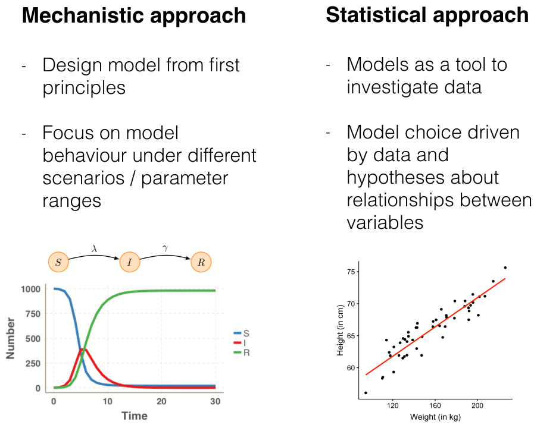
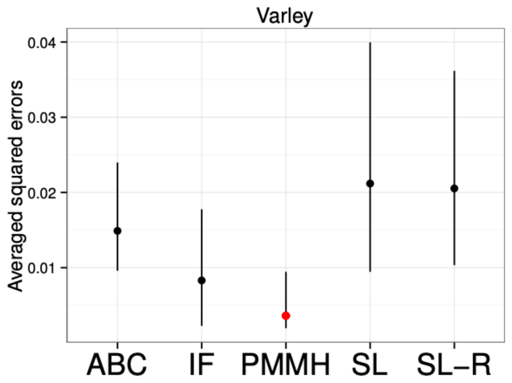

# What we did

##  {.center}

{.bigpic}

## Four days

- **Monday**: priors, likelihoods, posteriors, and MCMC to sample the posterior
- **Tuesday**: did the sampler work, is the model any good, and a stochastic
  model that broke the likelihood
- **Wednesday**: a particle filter to estimate it, pMCMC to sample with the
  estimate, and what an observation model assumes
- **Thursday**: ABC, for when there is no likelihood to estimate

Nearly all of it fitted to the same 59 days from Tristan da Cunha.

# Where it sits

## Two traditions

{.bigpic}

The week has been the join of the two: a model built from first principles,
confronted with data.

## Inference in one loop

{.bigpic}

## The method is one choice

A model turns parameters into data. Inference runs that arrow [backwards]{.alert}.

Which method runs it backwards is one choice. Which software implements the
method is a separate one, and the week has been quiet about it.

The loop returns parameters. A particle filter also returns the states: what the
epidemic was doing on each day.

## The methods we did not do {.smaller}

|  | Frequentist | Bayesian |
|---|---|---|
| Needs the model's densities | EM, Kalman filter | **MCMC** |
| Simulator only, whole likelihood | iterated filtering | **particle MCMC** |
| Simulator only, summaries | synthetic likelihood | **ABC** |

[after Aaron King, [Simulation-based Inference for Epidemiological Dynamics](https://kingaa.github.io/sbied/)]{.cite}

We spent the week in the right-hand column. The left one answers the same
questions without a prior, and iterated filtering is the one you are most likely
to meet.

The rows are what the method demands of you. Everything below the first line
needs only a simulator, which is why it survives a model you can only run
forwards. When one simulation takes hours, even that is too much, and you fit a
cheap stand-in to the simulator instead: emulation and history matching.

## Exact and approximate {.smaller}

The particle filter gives a [noisy]{.alert} likelihood estimate, and pMCMC still
targets the exact posterior. Run it for longer and it converges.

ABC does not. The tolerance and the choice of summaries set a floor that no
amount of sampling reaches past.

Variational inference and neural posterior estimation sit on the same side of
that line: the approximating family, or the trained network, sets the floor.

So ask what more computation buys you: accuracy, or a sharper picture of a fixed
approximation.

## Other people's software {.smaller}

- **pomp** (R): iterated filtering and particle methods, and the course that
  goes with them
- **odin**, **dust** and **monty** (R): stochastic models and the samplers to
  fit them, behind a lot of UK outbreak modelling
- **LibBi** and **rbi** (R): particle MCMC on GPUs
- **Stan**, **NumPyro**, **PyMC**: gradient-based sampling for models with a
  tractable likelihood
- **Turing.jl**: what we used, and the reason this course is now in Julia

The last two are probabilistic programming languages: you write the model and
the sampler comes with it.

The method and the implementation are separate choices. Ours were Julia's, and
yours do not have to be.

# Choosing

## Four choices behind one fit {.smaller}

To fit SEITL we picked a stochastic model, a Gillespie simulator, pMCMC and
Turing.

Those are the four choices behind any fit [@funk2020]:

1. **The model**: deterministic or stochastic, and how complex
2. **The simulation method**: an ODE solver, Gillespie, or tau-leaping
3. **The inference method**: full information or summaries, Bayesian or
   frequentist
4. **The software**: a package, a language, or code of your own

The loop has a box for each. The course made all four for you. Your own problem
will leave them open.

## The choices interact

Software constrains method: a package implements what it implements.

The model constrains method: one expensive enough to simulate rules out anything
that needs a million runs.

So there is no flowchart over methods alone. A choice made for good reasons in
one box narrows the other three.

## Four criteria {.smaller}

1. **Model adequacy**: can the model do the job you built it for? A
   deterministic model cannot represent uncertainty, so it is a poor choice
   when the uncertainty is the point.
2. **Computational efficiency**: cost of one simulation, times how many.
   Amortised methods break that arithmetic, paying once in training and then
   fitting in seconds.
3. **Statistical accuracy**: how close is the approximation to the posterior you
   meant?
4. **Coding efficiency**: how much of your own time it takes, which rarely
   appears in a talk and is where most of a year goes.

[@funk2020]{.cite}

Tuesday was the first of those in one dataset.

## Generality is not free {.smaller}

[@fasiolo2016]{.cite}

Five methods, one model, one dataset. The two that use the whole likelihood come
first; the three that work from summaries pay for the generality.

You care about the time to an answer you trust, and that depends on the breadth
of the prior, the information in the data and the shape of the posterior.

## Two questions route the method {.smaller}

**Can you evaluate** $p(\text{data} \mid \theta)$**?**

If not, you are in simulation-based territory: a particle filter to estimate it,
or ABC to do without it.

**Can you differentiate it?**

If you can, use NUTS. If you cannot, an adaptive random walk such as RAM.

That settles one box of the four. The other three are still yours to argue.

## Where to start {.smaller}

One order is to get something working with an approximate method, then move to
full information for the results you publish [@fasiolo2016].

The other is to start from the model your question needs and find out whether
full-information inference is feasible at all [@funk2020]. The approximate first
step costs time and can mislead.

Both are defensible. What is not is drifting into an approximate method by
accident, because it then decides for you which features of the data carry
information.

## It is almost never the sampler {.smaller}

**The observation model**: Poisson on overdispersed data gives an overconfident
posterior, and one bad day dominates the fit.

**The priors**: `Uniform(1, 20)` on $R_0$ says 19 is as plausible as 2.

**Identifiability**: if two parameters trade off, the data cannot separate them
and no sampler will. That is a property of model and data.

**The model**: one that cannot produce your data will not be rescued by better
inference.

## The asymmetry worth remembering

Sampler problems are [loud]{.alert}: R̂, divergences, ugly trace plots.

Model problems are [silent]{.alert}. A converged chain from a bad model looks
exactly like a converged chain from a good one.

That is why model checking is a separate job from diagnostics.

##  Your Turn {background-color="#447099" transition="fade-in"}

Take the model *you* want to fit.

- Is the process stochastic in a way that matters at your population size?
- Can you write the likelihood? Can you differentiate it?
- How expensive is one simulation, and how many can you afford?
- What would tell you that the fit had failed?

Then compare with the person next to you. The disagreements are the useful part.

# Where to go next

## Further topics {.smaller}

- **Variational inference**: an optimisation in place of a sample, for when the
  answer has to arrive today
- **Neural posterior estimation**: train once, then fit the same model to new
  data in seconds
- **Universal differential equations**: a neural network inside the model, for
  the part of the mechanism you do not know
- **Beyond Turing**: other samplers, automatic differentiation backends, and
  what sits underneath the Julia we have been using

Two of them are on the approximate side of that line, trading exactness for
speed. All four are on the site, written to be worked through on your own.

## Further reading {.smaller}

- @funk2020 sets out the four choices and four criteria, with worked
  examples in pomp and rbi that you can run.
- @li2018 compare these approaches on epidemic models. This course is the
  practical version of that paper.
- Aaron King's [Simulation-based Inference for Epidemiological
  Dynamics](https://kingaa.github.io/sbied/) is the same territory from the
  iterated-filtering side.
- @andrianakis2015 is the tutorial for emulation and history matching, for
  models far too expensive to fit by any of the above.
- [Nowcasting and forecasting infectious disease
  dynamics](https://nfidd.github.io/nfidd/) picks up where we stopped: data that
  arrive late, incomplete, and from several streams at once.

## Before you go {.smaller}

- A short **feedback survey** is coming by email. It is how the course changes,
  so please fill it in.
- Everything here stays online and is MIT licensed. Reuse it, with attribution.
- The [Discussion board](https://github.com/mfiidd/mfiidd/discussions) is for
  questions, and for showing what you have fitted.
- [Open an issue](https://github.com/mfiidd/mfiidd/issues) for anything wrong,
  unclear or broken. That helps the next cohort.

## Thank you {background-color="#447099" transition="fade-in" .center}

### [mfiidd.github.io/mfiidd](https://mfiidd.github.io/mfiidd/)

Come and find us on the Discussion board, and tell us what you end up fitting.
