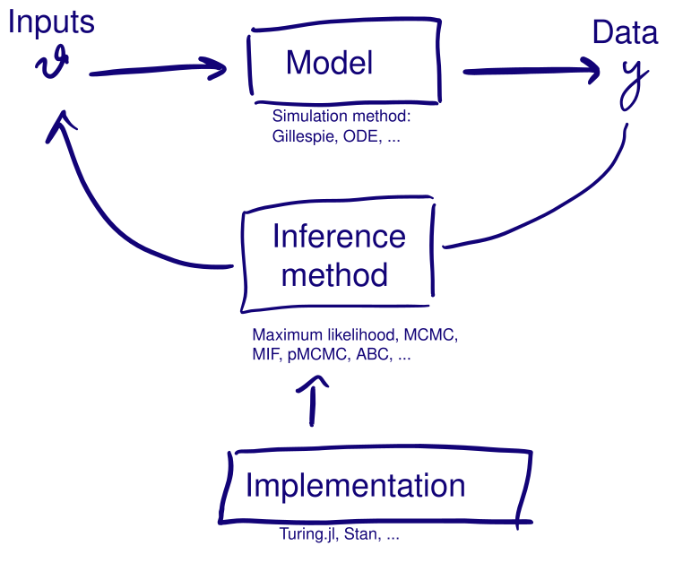

# What we did

##  {.center}

{.bigpic}

## 3.5 days

- **Monday**: priors, likelihoods, posteriors, and MCMC to sample them
- **Tuesday**: convergence diagnostics, posterior predictive checks, and the
  stochastic SEITL model that broke the likelihood
- **Wednesday**: the particle filter to estimate that likelihood, pMCMC to
  sample with the estimate, and the observation model
- **Thursday**: ABC, and likelihood-free inference

## What happened to the likelihood {.smaller}

**Monday.** A deterministic model puts all the mass of $p(x \mid \theta)$ on one
trajectory, so $p(y \mid \theta) = p(y \mid x = f(\theta), \theta)$ and you
evaluate it directly.

**Tuesday.** The stochastic model made it an integral over every trajectory,
$p(y \mid \theta) = \int p(y \mid x, \theta)\, p(x \mid \theta) \,\mathrm{d}x$,
with no closed form.

**Wednesday.** The particle filter estimated that integral without bias, and
pMCMC sampled with the estimate.

**Thursday.** ABC dropped it for
$p\big(d(S_y,\, S_{\text{sim}(\theta)}) < \epsilon\big)$.

# The bigger picture

## Inference in one loop

{.bigpic}

## Four choices {.smaller}

Every fit settles four questions, whether or not you notice deciding them
[@funk2020]. Three of them are labelled on the loop:

1. **The model**: deterministic or stochastic, and how complex
2. **The simulation method**: an ODE solver, Gillespie, or tau-leaping
3. **The inference method**: full information or summaries, Bayesian or
   frequentist
4. **The software**: a package, a language, or code of your own

To fit SEIT4L we picked a stochastic model, a Gillespie simulator, pMCMC, and
Julia with Turing.jl.

## How to choose?

The main criteria are:

1. A model suitable for the question at hand (**model adequacy**)
2. Being able to do the inference in the time available (**computational
   efficiency**)
3. Getting a correct answer (**statistical accuracy**)
4. Being able to write the model down correctly and quickly (**coding
   efficiency**)

## Model adequacy

The right model comes before any inference procedure. Can it generate data like
yours, for the purpose you built it for?

A deterministic model puts all the mass of $p(x \mid \theta)$ on one trajectory,
so it cannot represent process noise. That matters in a small population, where
stochastic fade-out is a real possibility rather than a rounding error.

## Computational efficiency

Total cost is the cost of one simulation, times the number of simulations the
method needs.

### Cost of one simulation

The simulation method and the implementation: an ODE solver against Gillespie,
compiled against interpreted.

### Number of simulations

The inference method. NUTS reaches a given ESS in far fewer iterations than a
random walk, and rejection ABC needs very large numbers of cheap forward
simulations.

## Statistical accuracy

pMCMC uses a [noisy]{.alert} likelihood estimate and still targets the exact
posterior. Run it for long enough and the Monte Carlo error falls as far as you
like.

ABC does not. $\epsilon$ and the choice of $S(y)$ bound the accuracy however long
you run it, so more computation sharpens an answer that stays biased.

## Coding efficiency

Your time: writing, testing, debugging.

## The choices interact

Software constrains method: a package implements what it implements.

The model constrains method: a model too slow to simulate rules out any procedure
needing a million runs.

## Probabilistic programming languages (PPLs)

In PPLs you write down the model specification, and the language takes care of
the simulator and the inference.

One definition of SEIT4L, and Turing will run `NUTS()` on a tractable
differentiable likelihood, `MH()` or `Emcee()` where there is no usable gradient,
and `SMC()`, `PG()` or `CSMC()` where the likelihood has to be estimated from
simulations. Wednesday was that: the model unchanged, the particle filter's
estimate added with `@addlogprob!`.

- **Turing.jl** in Julia
- **Stan** in R, Python or Julia
- **NumPyro** and **PyMC** in Python

## When things don't work {.smaller}

**Slow, sticky, or divergent** is often the sampler, and often fixable: retune
the proposal, reparameterise the model raise the particle count until the
variance of the log-likelihood estimate is around one.

**Biased, overconfident, or wrong** is not due to the sampler.

- **The observation model**: Poisson on overdispersed counts gives an
  overconfident posterior, and one outlying day dominates the fit
- **The priors**: `Uniform(1, 20)` on $R_0$ says 19 is as plausible as 2
- **Identifiability**: two parameters that trade off cannot be separated by any
  sampler, being a property of model and data
- **The model**: one that cannot generate your data will not be rescued by
  better inference

## Checking the model

**Two separate modes of checking**

Sampler problems: R̂, divergences, low ESS, sticky traces.

Model problems: posterior predictive checks, predictive p-values.

Both are necessary. A converged chain from a misspecified model looks exactly
like a converged chain from an adequate one.

## A recipe for your own model {.smaller}

**1. Start with the question.** Name the quantity you need to learn and the data
that can inform it.

**2. Write the generative story.** Separate the epidemic process from the
observation process, and decide where stochasticity belongs.

**3. Simulate before fitting.** Draw parameters from the prior and run the whole
model. If it cannot generate plausible data, revise the model or prior now.

## Fit, check, revise {.smaller}

**4. Choose a method that fits the model and your computational budget.**

**5. Check the computation.** Use multiple runs, traces, R̂, ESS and method-specific
warnings to establish that the algorithm explored its target.

**6. Check the model.** Use posterior predictive checks and sensitivity analyses
to ask whether the fitted model reproduces the features that matter to your
question. If it does not, revise the model and go round again.

[A workflow for infectious disease
modelling](https://samabbott.co.uk/a-workflow-for-infectious-disease-modelling/paper.pdf)
(Abbott et al., work in progress) sets out the full version, including how to combine data
sources.

# Where to go next

## Further topics {.smaller}

- **Variational inference**: optimisation over a variational family in place of
  sampling, for when the answer is needed in real time
- **Neural posterior estimation**: amortised inference with normalising flows,
  for a model you fit many times
- **Universal differential equations**: a neural closure term inside the model,
  for the part of the mechanism you cannot write down
- **Beyond Turing**: other samplers, automatic differentiation backends, and
  what sits underneath the Julia we have been using

All four are on the course site, written to be worked through on
your own.

## Beyond the core sessions

Across the course site, **Going further** and advanced sections point to
extensions of the methods we taught and the literature behind them.

[Nowcasting and forecasting infectious disease
dynamics](https://nfidd.github.io/nfidd/) is our course on real-time infectious
disease modelling.

## Before you go {.smaller}

- A **feedback survey** at [bit.ly/4h086oM](https://bit.ly/4h086oM), also coming
  by email. This is the first time we have taught the material in this form, so
  please fill it in.
- Everything here stays online and is MIT licensed. Reuse it, with attribution.
- The [Discussion board](https://github.com/mfiidd/mfiidd/discussions) is for
  questions, and for showing what you have fitted.
- [Open an issue](https://github.com/mfiidd/mfiidd/issues) for anything wrong,
  unclear or broken. That helps the next cohort.

## Thank you {background-color="#447099" transition="fade-in" .center}

### [mfiidd.github.io/mfiidd](https://mfiidd.github.io/mfiidd/)
