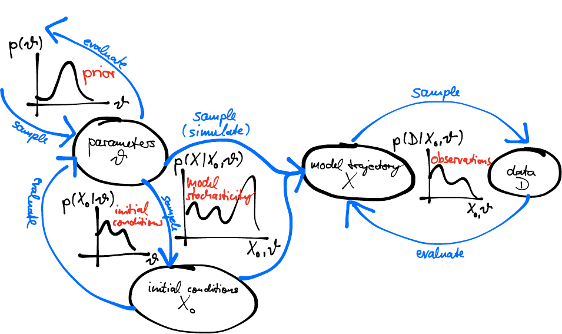

## Has the chain converged?

{.step}

Straight, plump at both ends, several chains on top of each other. Then put a
number on it: $\hat{R} = \sqrt{\hat{V}/W}$ compares the variance between chains
with the variance within them, and wants to be below 1.01.

## Before you see the data

{.step}

$\theta^{(i)} \sim p(\theta), \qquad y^{(i)} \sim p(y \mid \theta^{(i)})$

Two hundred draws from our priors, on an island of 284. Most burn through the
population in a week.

## After fitting

{.step}

$\theta^{(i)} \sim p(\theta \mid y), \qquad y^{\text{rep},(i)} \sim p(y \mid \theta^{(i)})$

The fitted SIR model produces the first wave and has nothing to say about the
second.

## Tristan da Cunha, 1971

{.step}

284 people and two waves. [SEITL]{.alert} adds temporary immunity so that a
fraction of those infected return to susceptible — and in a population this
small, chance decides how many.

## Which makes the likelihood an integral

{.step}

$$p(\text{data} \mid \theta) = \int_{X} p(\text{data} \mid X, \theta)\, p(X \mid \theta)$$

The state $X$ is hidden and random, so every trajectory the model could have
taken contributes. That is where today starts.

##  Questions? {background-color="#447099" transition="fade-in"}

Anything from yesterday worth revisiting.

#

[MCMC diagnostics](../mcmc_diagnostics.qmd) &middot;
[Model checking](../model_checking.qmd) &middot;
[SEITL](../seitl.qmd)
