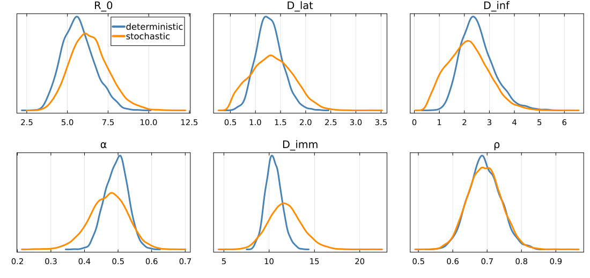
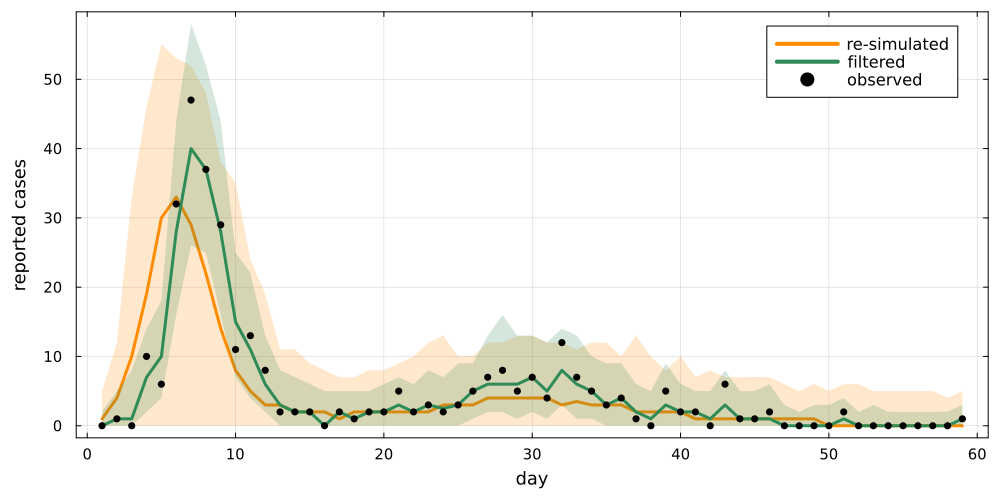
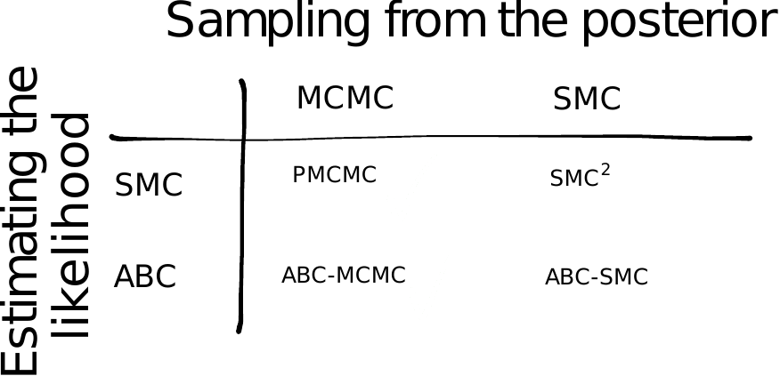

# The story so far

## Deterministic models

{.step}

$$p(\theta \mid \text{data}) \propto p(\text{data} \mid \theta)\, p(\theta)$$

Use MCMC to get **samples** from it: $\theta_1, \theta_2, \theta_3, \ldots$

## Stochastic models

{.step}

- What is $p(\text{data} \mid \theta)$?
- We need to **marginalise**:

  $$p(\text{data} \mid \theta) = \int_{X} p(\text{data} \mid X, \theta)\, p(X \mid \theta)$$

## The particle filter

::: {.r-stack}
{.pfwide .fragment .fade-out fragment-index=1}
{.pfwide .fragment .current-visible fragment-index=1}
{.pfwide .fragment .current-visible fragment-index=2}
{.pfwide .fragment .current-visible fragment-index=3}
{.pfwide .fragment fragment-index=4}
:::

::: {.cite}
Red diamonds are the data, yellow circles the particles, sized by weight.
:::

## The estimator

Average the weights each day, before resampling:

$$\hat{p}(y \mid \theta) = \prod_{t=1}^{T} \frac{1}{J}\sum_{j=1}^{J} w_{t,j}$$

. . .

A Monte Carlo estimate of the integral, built one day at a time.

# Particle MCMC

## The estimate goes inside Metropolis-Hastings

$$r = \min\left(1, \frac{\hat{p}(y \mid \theta^*)\, p(\theta^*)}{\hat{p}(y \mid \theta)\, p(\theta)}\right)$$

. . .

Unbiased $\hat{p}$, so the chain still targets the [right posterior]{.alert}.

## Deterministic vs. stochastic

::: {.cite}
Same SEIT4L model, priors and data.
:::

## Filtered vs. resimulated trajectories

::: {.cite}
Filtered paths are conditioned on data, resimulated just drawn from parameters that are.
:::

##  {.center}

##  Questions? {background-color="#447099" transition="fade-in"}

Anything from the first three days worth revisiting before the last session.

#

[Deterministic fitting](../introduction.qmd) &middot;
[Stochastic models](../seitl.qmd) &middot;
[Particle filters](../particle_filters.qmd) &middot;
[Particle MCMC](../pmcmc.qmd)
