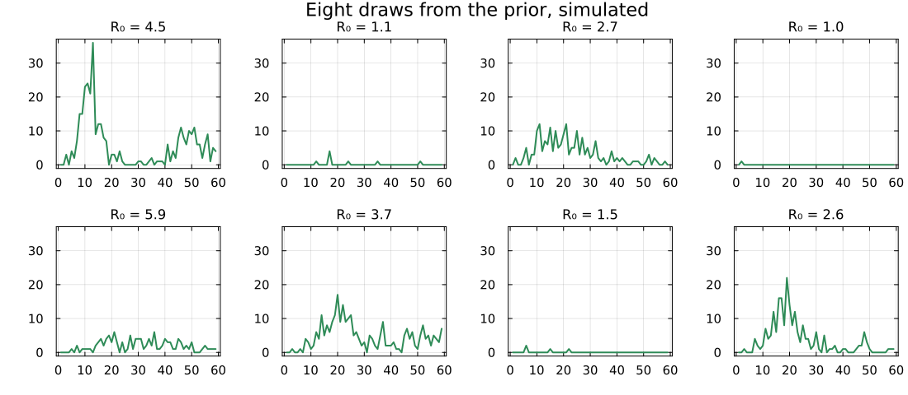
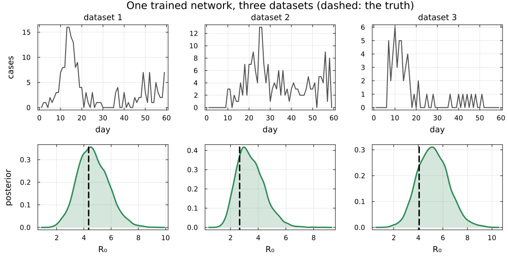
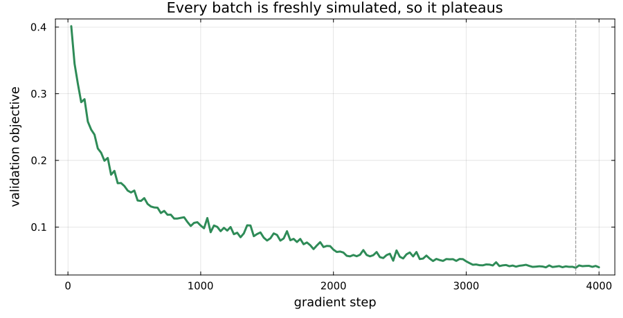
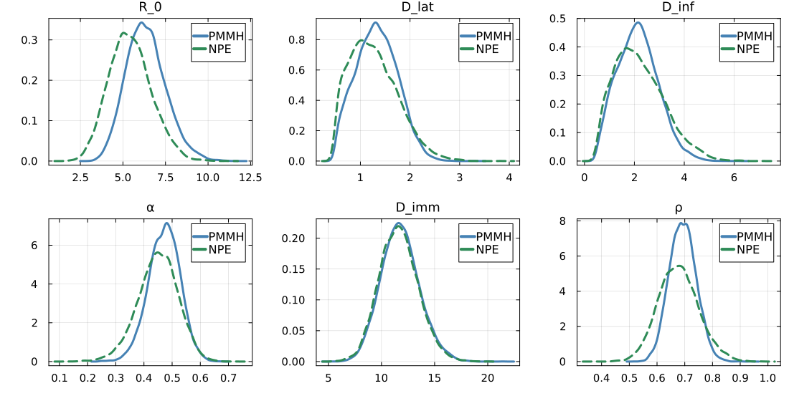
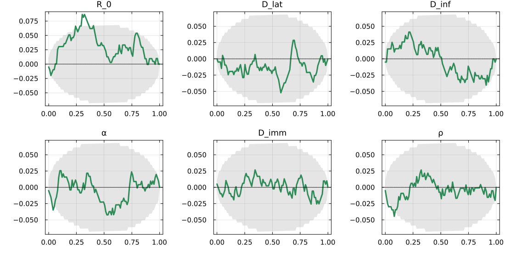
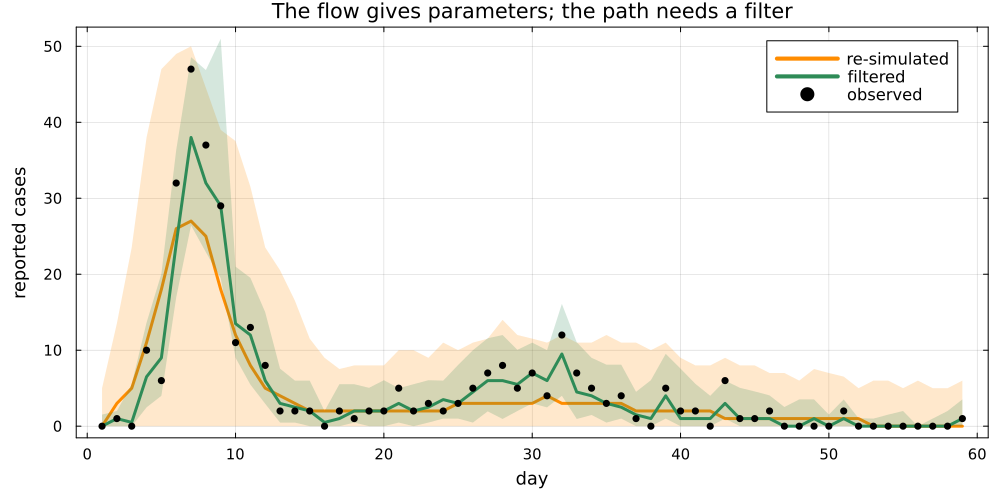
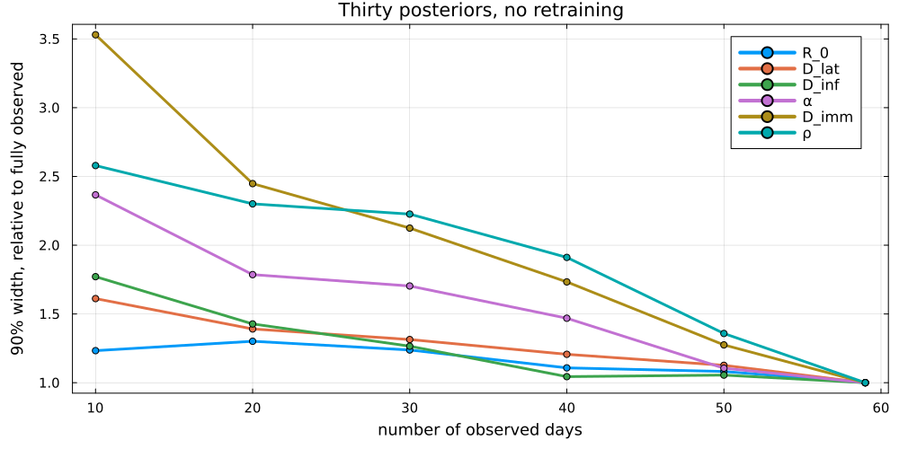

# Paying for the same answer twice

## Where we got to

PMMH gave us the SEIT4L posterior.

. . .

Every likelihood evaluation was a full particle filter.
The committed chain ran half a million of them.

. . .

Ask about a second island, or a different reporting schedule, and you pay the
whole cost again.

## A different question

Instead of asking

> what is the posterior *for this dataset*?

. . .

ask

> what is the posterior *as a function of the data*?

. . .

Answer that once and every later dataset is a lookup.
This is [amortised]{.alert} inference.

## What it costs

Simulating the 512,000 outbreaks a training run consumes: about two minutes.

. . .

The same number of 256-particle likelihood evaluations: hours.

. . .

We spend simulation and buy back the likelihood evaluations.

## The trade

We never write down a likelihood.
We only ever [simulate]{.alert}.

. . .

$$\theta \sim p(\theta), \qquad y \sim p(y \mid \theta)$$

Those pairs are the training data.

# Learning the map

## Simulate the training set

## What we train

A network $q_\phi(\theta \mid y)$ that takes data in and returns a distribution
over parameters.

. . .

Fit it by maximising the density it puts on the parameters that actually
produced each simulation.

. . .

The minimiser of that loss is the true posterior.

::: {.cite}
@papamakarios2016
:::

## How a distribution comes out of a network

A [normalising flow]{.alert}: an invertible map carrying a standard normal onto
the posterior.

. . .

Split the parameters in two.
One half, plus the data, chooses a scale and a shift for the other half.

. . .

Invertible by construction, so we can both score it and sample from it.

## One network, three datasets

## Never reuse a simulation

A fresh batch every gradient step, so there is nothing to overfit to.

# Does it work?

## Against the chain we trust

## Wider, mostly

Five of the six NPE intervals are [wider]{.alert} than the PMMH one, by 8 to 38
per cent.

. . .

`R_0` is the exception: its width matches PMMH almost exactly, while its centre
sits about a posterior standard deviation low.

. . .

Wider on this run. A flow trained on a finite budget is often too narrow instead
[@hermans2022].

. . .

A matching width says nothing about where an interval sits.

## Calibration

## What the ranks say

Simulate from the prior, fit, and record where the truth falls among the draws.
Calibrated means uniform.

. . .

`R_0` rises above the band: ranks skewed low, so the estimator centres it too high.

. . .

Convergence says a sampler settled; calibration tests where it settled, though
even the prior passes it [@talts2018]. A flow only has the second.

# The catch

## Amortisation stops at the parameters

## Parameters are free; paths are not

The flow returns $\theta$ in milliseconds, for any dataset, forever.

. . .

It holds no latent path, so a trajectory conditioned on the data still costs a
particle filter run — one per trajectory.

. . .

Still a bargain beside half a million.

## The pay-off

## When to reach for it

Once, for one dataset: use PMMH.

. . .

The hundredth time, for the hundredth dataset: amortisation wins.

. . .

And when there is no likelihood to write down, only a simulator.

##  Your Turn {background-color="#447099" transition="fade-in"}

In the practical you will

- simulate a training set from the stochastic SEIT4L model
- build a conditional coupling flow and train it in about forty lines
- draw ten thousand posterior samples in milliseconds and check them against PMMH
- see calibration and the comparison with PMMH land on the same parameter, and disagree about which way it is off
- compare surveillance schedules the network was never trained on

#

[Return to the session](../neural_posterior_estimation.qmd)
