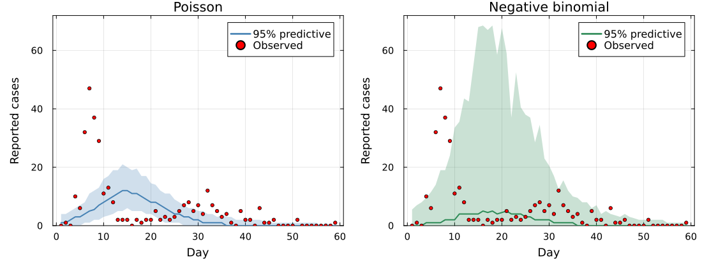

# Observation models

## The choice we have been making silently

Every likelihood in this course so far has assumed

$$y_t \sim \text{Poisson}(\lambda_t)$$

where $\lambda_t$ is what the model predicts at time $t$.

. . .

That is a modelling **choice**, not a law. It encodes a specific claim about how
observation works, and it has consequences.

## What Poisson assumes

- The variance **equals** the mean. Expect 100 cases, expect a spread of about
  $\pm 10$.
- Every case is reported independently with the same probability.

. . .

Writing the likelihood as a product over time points assumes the observations
are [conditionally independent]{.alert} given the trajectory, as on Monday. That
is a separate assumption, and it survives changing the distribution.

. . .

Surveillance data breaks both. Weekend dips and reporting delays move the
reporting probability around; clustered transmission pushes the variance above
the mean.

## Overdispersion

When the data are more variable than Poisson allows, the fix is an observation
model with a free variance:

$$y_t \sim \text{NegativeBinomial}(\lambda_t, \phi)$$

. . .

- $\phi \to \infty$ recovers the Poisson
- small $\phi$ allows a much wider spread at the same mean

. . .

The cost is one extra parameter. The benefit is that the model stops treating
every unusual day as strong evidence against the trajectory.

## Why it matters for inference

An observation model that is too tight makes the posterior too confident.

. . .

A day with 47 cases where the model expects 5 is near-impossible under Poisson,
so the intervals collapse around a trajectory that never reaches it.

Under a negative binomial the same day is merely unusual and the intervals widen.
The trajectory does not move closer: a single-wave model still cannot fit a
two-wave outbreak.

## The same data, two observation models

The negative binomial covers 90% of the days against the Poisson's 59%, with a
band 3.7 times wider. Its median curve is [lower]{.alert}, not closer: the noise
absorbed the misfit instead of the trajectory improving.

## Likelihood as a distance

The negative log-likelihood of one observation, as a function of how far it sits
from the prediction, is a **distance function**.

. . .

- Poisson penalises large relative deviations sharply
- Negative binomial is more forgiving in the tails
- Gaussian penalises absolute deviations symmetrically

. . .

So a different observation model is a different distance. Which invites the
question: what if we chose the distance **directly**?

## The question this raises

. . .

Once you see the likelihood as a distance: what if we chose the distance
[directly]{.alert}?

. . .

That is tomorrow morning.

##  Your Turn {background-color="#447099" transition="fade-in"}

In the practical you will

- fit the Tristan da Cunha data with a Poisson observation model
- check whether its variance assumption actually holds for the data
- refit with a negative binomial and compare
- see the likelihood plotted explicitly as a distance function

#

[Return to the session](../observation_models.qmd)
