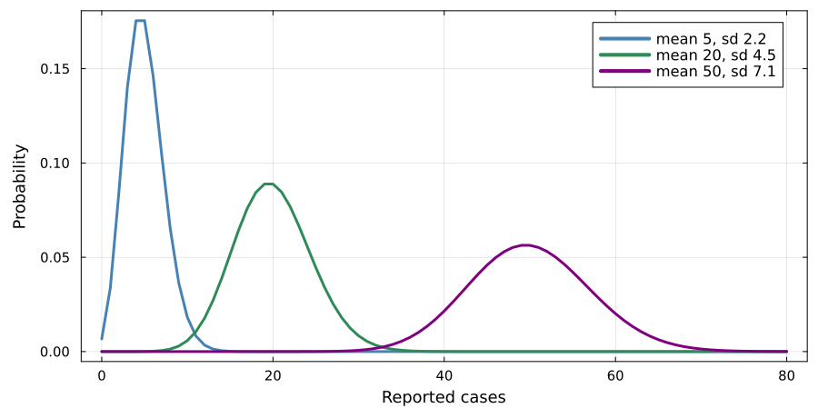
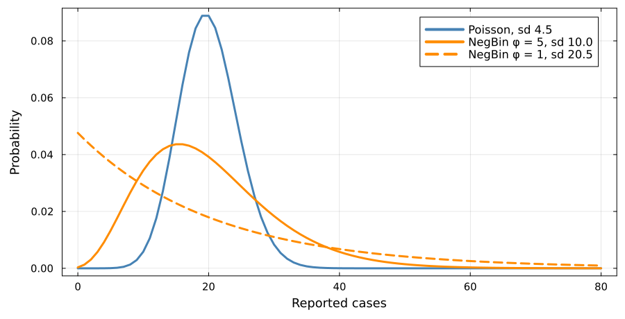
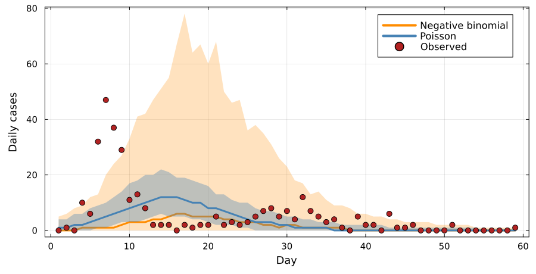
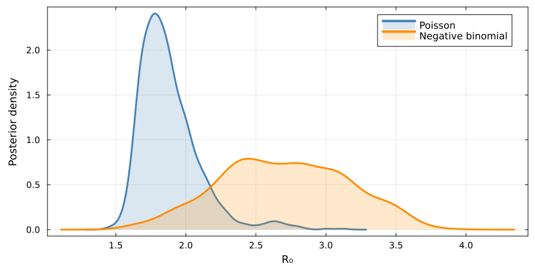
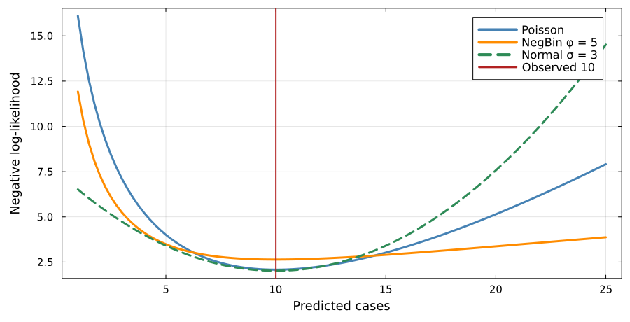

# Observation models

## The choice we have been making silently

Every likelihood in this course so far has assumed

$$y_t \sim \text{Poisson}(\lambda_t)$$

where $\lambda_t$ is what the model predicts at time $t$.

. . .

That is a modelling [choice]{.alert}.
It makes a specific claim about how observation works.

## What Poisson assumes

- The variance **equals** the mean. Expect 100 cases, expect a spread of about
  $\pm 10$.
- Observations at different times are **conditionally independent** given the
  trajectory.
- Every case is reported independently with the same probability.

. . .

Weekend effects, reporting delays, outbreak investigations and clustered transmission all break these assumptions.

## One parameter, so one spread

The mean fixes the spread.

## Overdispersion

When the data are more variable than Poisson allows, the fix is an observation model with a free variance:

$$y_t \sim \text{NegativeBinomial}(\lambda_t, \phi)$$

. . .

- $\phi \to \infty$ recovers the Poisson
- small $\phi$ allows a much wider spread at the same mean

. . .

The cost is one extra parameter.

## The same mean, three spreads

## What each model expects the data to look like

Both fits use the same SIR model on Tristan da Cunha.
Only the observation model differs.

## Why it matters for inference

An observation model that is too tight makes the posterior too confident.

. . .

Day 7 reports 47 cases where the Poisson fit predicts about five.
That is near-impossible under Poisson, so the posterior narrows around a trajectory that never reaches it.

. . .

Under a negative binomial the same day is merely unusual, so the intervals widen.

## The posteriors disagree

The interval widens and the estimate moves.
A single-wave model still cannot fit a two-wave outbreak.

## Likelihood as a distance

The negative log-likelihood of one observation, as a function of how far it sits from the prediction, is a **distance function**.

. . .

- Poisson penalises large relative deviations sharply
- Negative binomial is more forgiving in the tails
- Gaussian penalises absolute deviations symmetrically

## Three likelihoods, three distances

## Tonight's question

Once you see the likelihood as a distance, an obvious one follows: what if we chose the distance [directly]{.alert}?

. . .

That is tomorrow morning.

##  Your Turn {background-color="#447099" transition="fade-in"}

In the practical you will

- fit the Tristan da Cunha data with a Poisson observation model
- check whether its variance assumption actually holds for the data
- refit with a negative binomial and compare
- see the likelihood plotted explicitly as a distance function

#

[Return to the session](../observation_models.qmd)
