# The likelihood for stochastic models

## Where we are

We know how to get a posterior when the model is **deterministic**:

$$p(\theta \mid y) \propto p(y \mid \theta)\, p(\theta)$$

. . .

One $\theta$ gives one trajectory, so the likelihood is a single calculation:
solve the ODE, evaluate the observation model, done.

. . .

Stochastic models break this.

## The marginal likelihood

The model has a latent state $x$ — the trajectory it actually took — which we do
not observe. To get the likelihood of $\theta$ we must **marginalise** over
every trajectory it could have taken:

$$p(y \mid \theta) = \sum_{x} p(y \mid x, \theta)\, p(x \mid \theta)$$

## The deterministic case is easy

For a deterministic model, $\theta$ determines the trajectory exactly:

$$p(y \mid \theta) = \sum_{x} p(y \mid x, \theta) \times \mathbb{1}_{x = f(\theta)}
= p\big(y \mid x = f(\theta), \theta\big)$$

. . .

The sum collapses to a single term. That is why everything has worked so far.

## The stochastic case is not

$$p(y \mid \theta) = \sum_{x} p(y \mid x, \theta)\, p(x \mid \theta)$$

. . .

Now $x$ is no longer known, and the number of possible trajectories is
potentially astronomical — every combination of every event at every time.

## Monte Carlo, first attempt

Sample $J$ trajectories from the model and average the likelihood of the data
under each. Simulating the model *is* drawing $x_j \sim p(x \mid \theta)$, which
is what makes the plain average the right estimator of the sum:

$$\hat{p}(y \mid \theta) = \frac{1}{J}\sum_{j=1}^{J} p(y \mid x_j, \theta)$$

. . .

Given the whole trajectory the observations are independent, so each term is
itself a product over the days:

$$\hat{p}(y \mid \theta) = \frac{1}{J}\sum_{j=1}^{J} \prod_{t=1}^{T} w_{t,j},
\qquad w_{t,j} = p(y_t \mid x_{t,j}, \theta)$$

## Two hundred trajectories, an effective two {.smaller}

{.pfwide}

Each $x_j$ is simulated **blind**, so passing near all 59 observations at once is
vanishingly rare.

## Filtering: use the data as you go

Do not wait until the end to compare with the data. Compare at *every*
observation, and keep the trajectories that are doing well:

$$\hat{p}(y \mid \theta) = \prod_{t} \Big( \frac{1}{J}\sum_{j=1}^{J} w_{t,j} \Big),
\qquad w_{t,j} = p(y_t \mid x_{t,j}, \theta)$$

. . .

The same $w_{t,j}$, the same particles — with the sum and the product swapped.

If we weight trajectories by $w_{t,j}$ and resample in proportion at every
observation, then the particles entering step $t$ are approximately drawn from
$p(x_t \mid y_{1:t-1}, \theta)$, so the data are steering them.

. . .

This is **sequential Monte Carlo**, better known as **particle filtering**.

## Can we swap them? {.smaller}

$$\underbrace{\prod_{t} \frac{1}{J}\sum_{j} w_{t,j}}_{\text{filter}}
\qquad\text{against}\qquad
\underbrace{\frac{1}{J}\sum_{j} \prod_{t} w_{t,j}}_{\text{simulate blind}}$$

Both are computable, and both are **unbiased** for $p(y \mid \theta)$. So the
answer is not about bias.

. . .

The right is importance sampling from the prior over whole trajectories. Its
variance grows **exponentially in $T$** — that is the collapse you just saw, and
it is why the swap is a firm no.

## Why the left one works {.smaller}

Each factor $\frac{1}{J}\sum_j w_{t,j}$ estimates $p(y_t \mid y_{1:t-1}, \theta)$
*conditional on the particles that survived*. Each is conditionally biased, and a
product of biased factors should compound the error.

. . .

It does not. Resampling makes the telescoping come out exactly, and the product
is unbiased on the nose.

. . .

That is not a technicality. It is what licenses **particle MCMC**: put $\hat{p}$
into a Metropolis acceptance ratio and the chain still targets the *exact*
posterior, because the noise is absorbed into an extended target on the particle
system. Swapping the operators keeps unbiasedness and destroys the variance
control — and variance is what decides whether the chain mixes.

## On the log scale {.smaller}

Compute $\log \hat{p} = \sum_t \log\big(\frac{1}{J}\sum_j w_{t,j}\big)$, each
inner sum by log-sum-exp. Never form the weights on the natural scale.

. . .

But $\log \hat{p}$ is **not** unbiased for $\log p$. Jensen puts it low by about
$\sigma^2/2$, where $\sigma^2 = \mathrm{Var}(\log \hat{p})$.

. . .

Fine for particle MCMC, which needs unbiasedness on the natural scale and gets
it. **Not** fine for dropping into an optimiser, or into a WAIC-style calculation,
as though it were the log-likelihood.

# The particle filter

## The algorithm

::: {.r-stack}
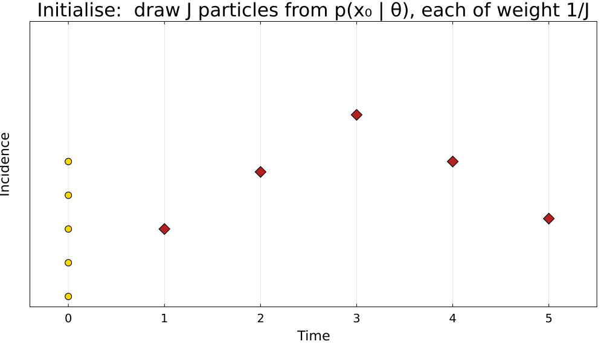{.pfwide .fragment .fade-out fragment-index=1}
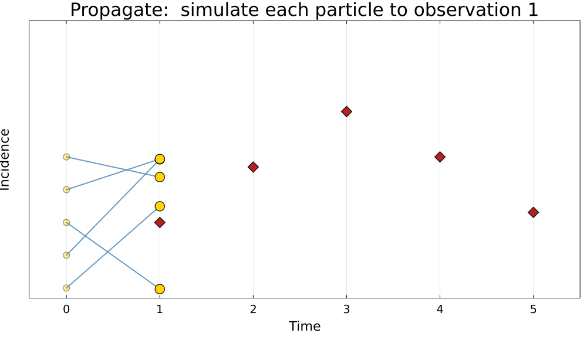{.pfwide .fragment .current-visible fragment-index=1}
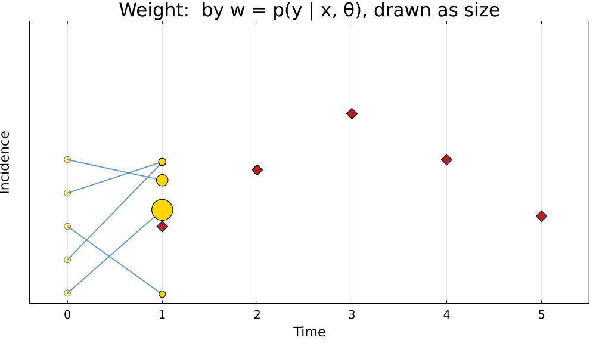{.pfwide .fragment .current-visible fragment-index=2}
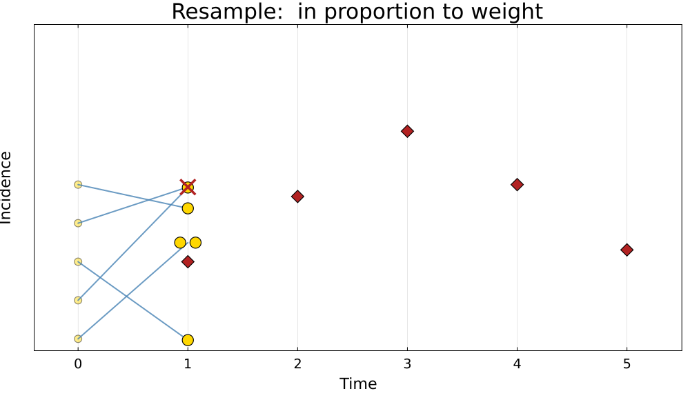{.pfwide .fragment .current-visible fragment-index=3}
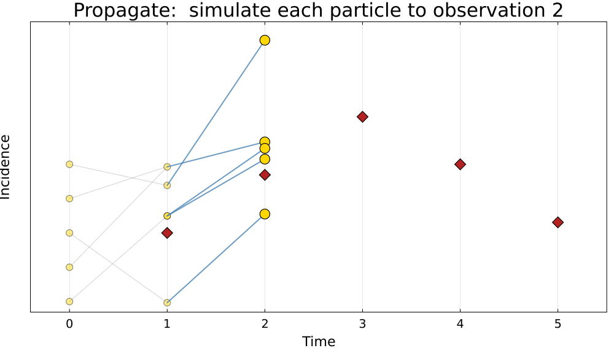{.pfwide .fragment .current-visible fragment-index=4}
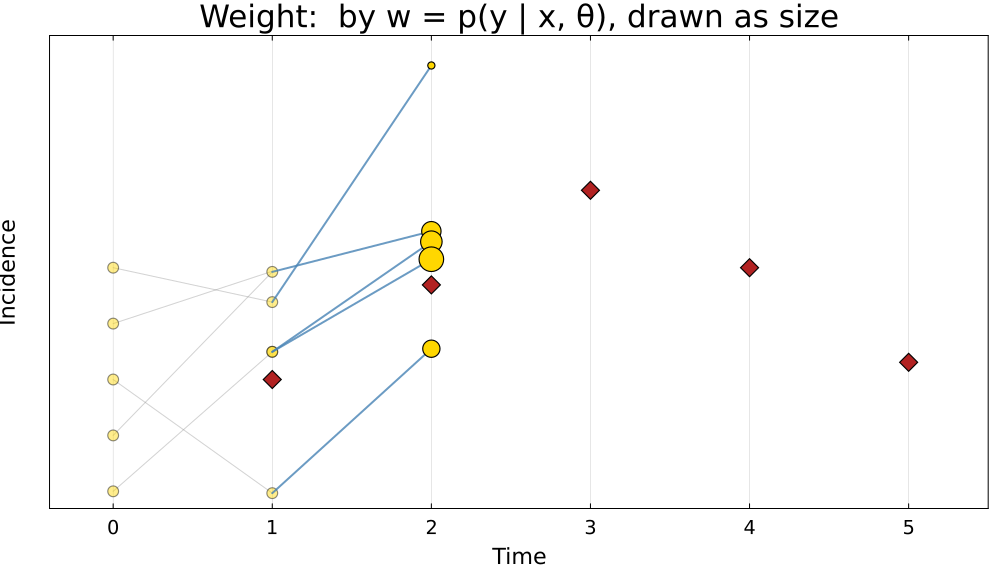{.pfwide .fragment .current-visible fragment-index=5}
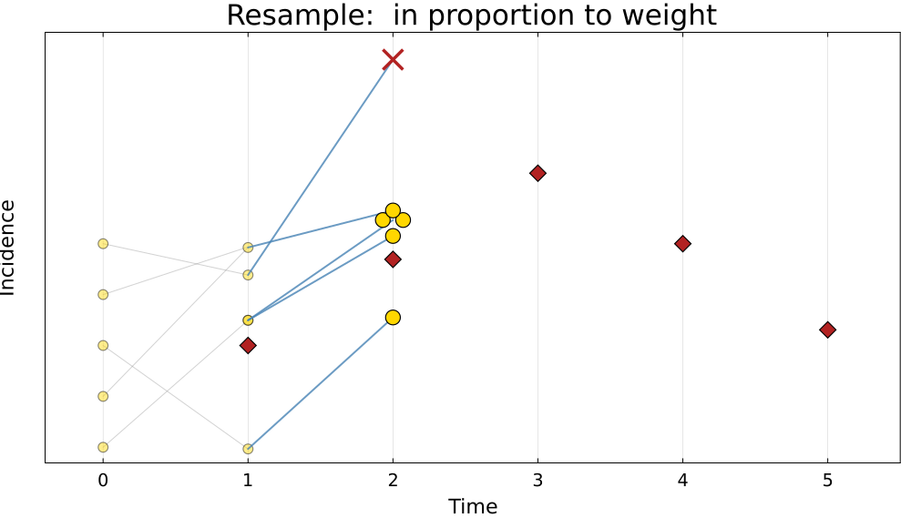{.pfwide .fragment .current-visible fragment-index=6}
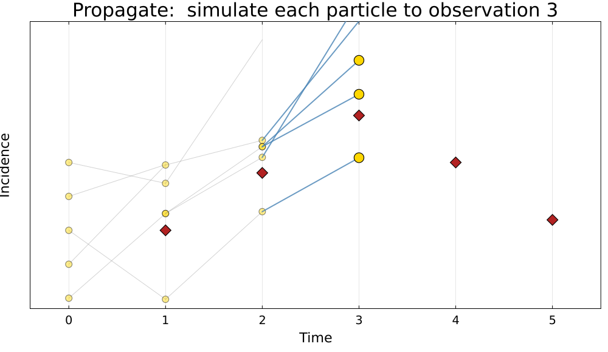{.pfwide .fragment .current-visible fragment-index=7}
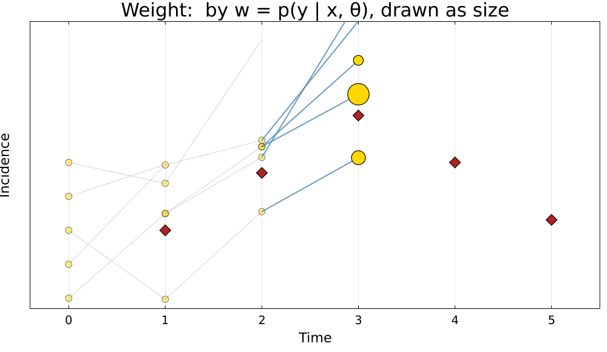{.pfwide .fragment .current-visible fragment-index=8}
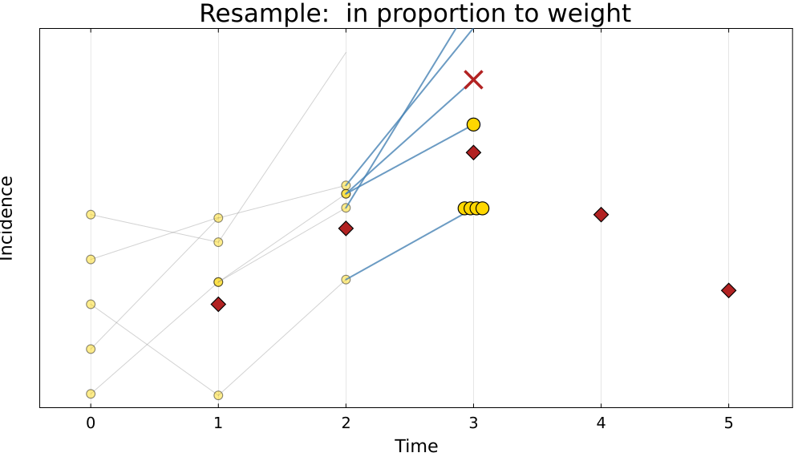{.pfwide .fragment .current-visible fragment-index=9}
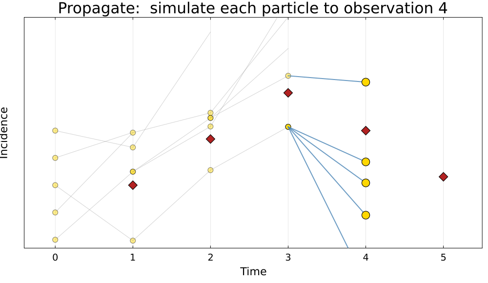{.pfwide .fragment .current-visible fragment-index=10}
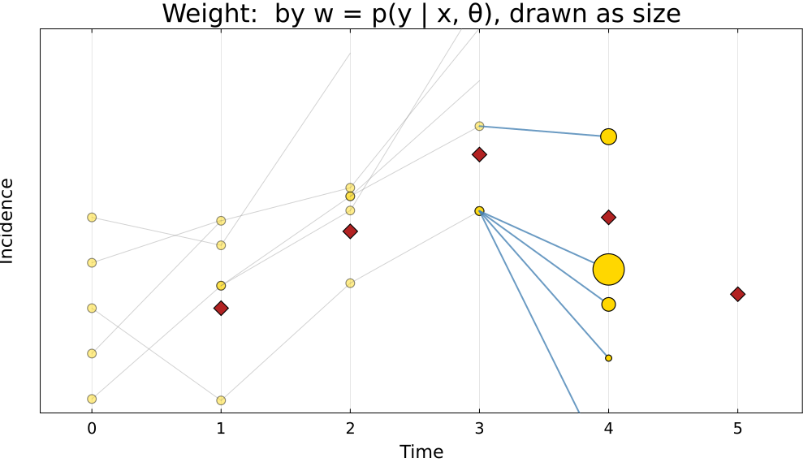{.pfwide .fragment .current-visible fragment-index=11}
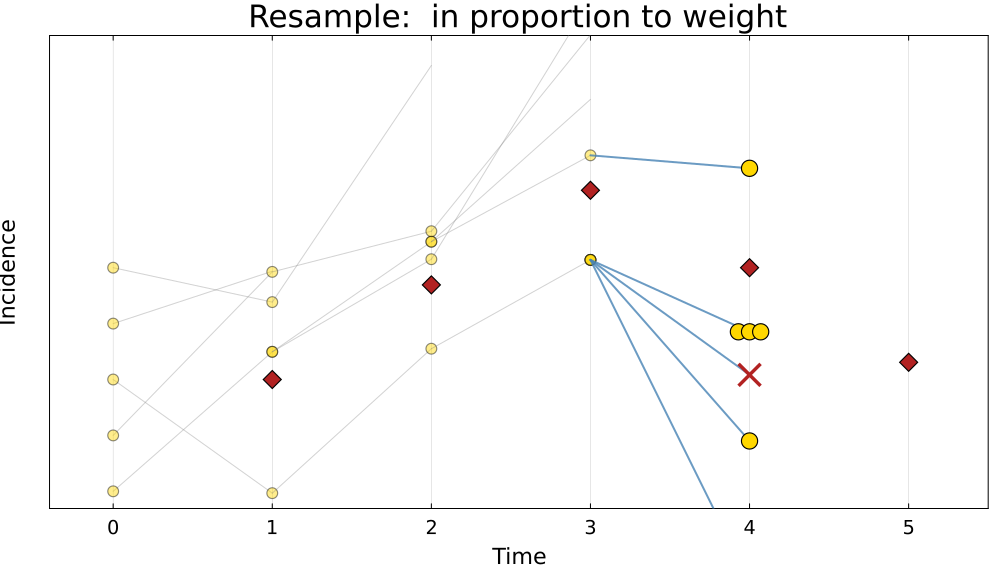{.pfwide .fragment .current-visible fragment-index=12}
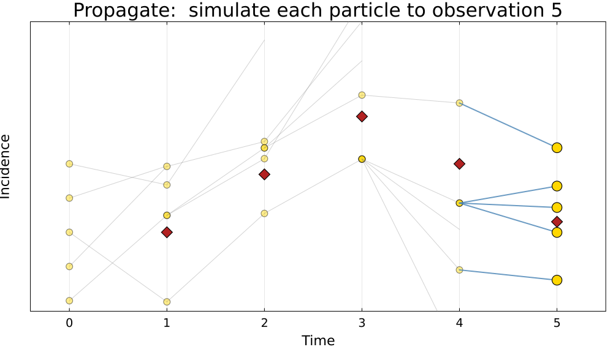{.pfwide .fragment .current-visible fragment-index=13}
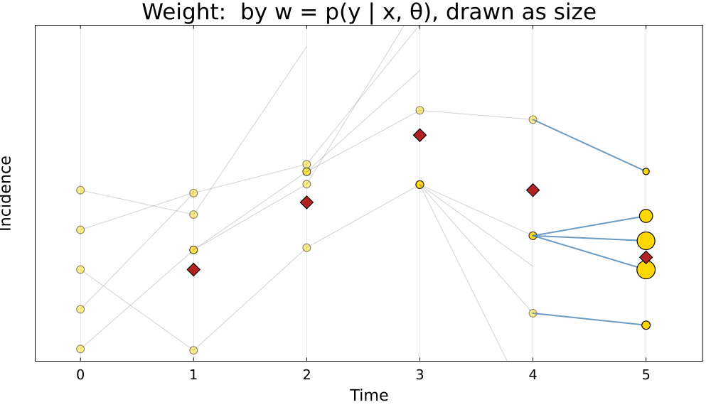{.pfwide .fragment .current-visible fragment-index=14}
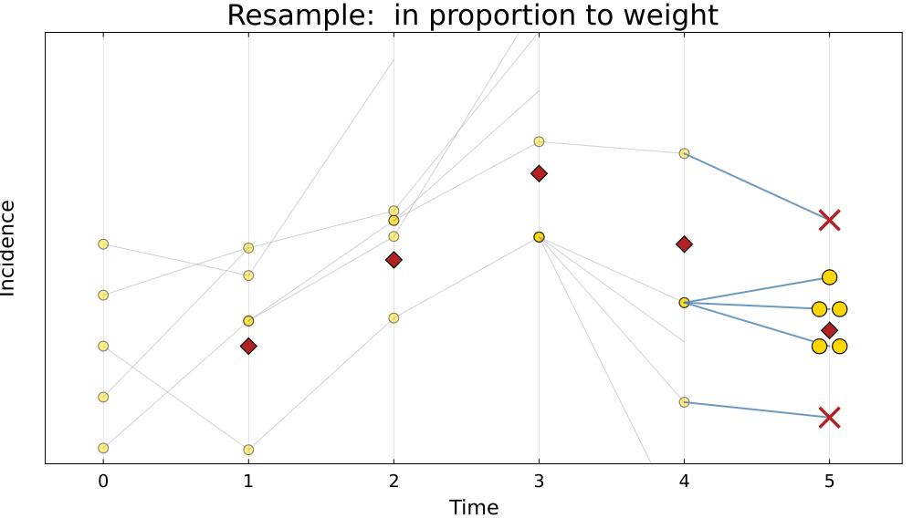{.pfwide .fragment fragment-index=15}
:::

::: {.cite}
Red diamonds are the data, gold circles the particles. Five observations, five
particles, and the whole run rather than one cycle. Here the starting particles
are spread to keep them apart; in the practical the island's initial state is
known exactly, so $p(x_0 \mid \theta)$ is a point and they all start together.
:::

## Why resample?

{.pfwide}

Without resampling the 200 particles are worth an effective 6 by day 10 and
exactly 1 from day 30 on: one trajectory, carrying the whole estimate.

. . .

This is **particle degeneracy**, and it is the central practical problem.
Resampling concentrates effort where the data say the trajectory actually went.

. . .

The cost is **depletion**: repeatedly copying survivors means the particles
share ancestry, so diversity falls over time.

## How many particles?

- Too few and the likelihood estimate is noisy, which will wreck the sampler
  that uses it.
- Too many and every likelihood evaluation becomes expensive.

. . .

The likelihood estimate is **unbiased** but **stochastic**: run it twice with
the same $\theta$ and you get two different numbers.

. . .

Tune $J$ against the spread of $\log \hat{p}$ at a representative $\theta$, near
the posterior mode. Too noisy and the chain sticks for long stretches on a lucky
estimate; too precise and you are buying particles rather than mixing. You
measure it in the practical.

## The whole thing, in code {.smaller .scrollable}

```julia
function bootstrap_filter(rng, θ, obs, n_particles; init_state)
    particles = [copy(init_state) for _ in 1:n_particles]
    loglik = 0.0

    for y in obs
        ## propagate: run every particle forward one day
        incidence = map(1:n_particles) do i
            particles[i], daily = gillespie_step(rng, particles[i], θ)
            daily
        end

        ## weight: how plausible is today's observation under each particle?
        log_w = logpdf.(Poisson.(θ[:ρ] .* incidence), y)

        ## accumulate: the mean weight estimates today's likelihood
        loglik += logsumexp(log_w) - log(n_particles)

        ## resample: keep the particles that explained the data
        w = exp.(log_w .- maximum(log_w))
        particles = particles[rand(rng, Categorical(w ./ sum(w)), n_particles)]
    end

    return loglik
end
```

Four steps, one loop. In the practical you read this one line by line, then swap
it for the bootstrap filter in `GeneralisedFilters.jl` behind the same interface.

##  Your Turn {background-color="#447099" transition="fade-in"}

In the practical you will

- see why a deterministic likelihood fails for a stochastic model
- watch particles propagate, get weighted, and be resampled
- read that filter line by line and work out what each step does
- explore how the number of particles affects the likelihood estimate


#

[Return to the session](../particle_filters.qmd)
