# The likelihood for stochastic models

## Where we are

We know how to get a posterior when the model is **deterministic**:

$$p(\theta \mid y) \propto p(y \mid \theta)\, p(\theta)$$

. . .

One $\theta$ gives one trajectory, so the likelihood is a single calculation:
solve the ODE, evaluate the observation model, done.

. . .

Stochastic models break this.

## The marginal likelihood

The model has a latent state $x$ — the trajectory it actually took — which we do
not observe. To get the likelihood of $\theta$ we must **marginalise** over
every trajectory it could have taken:

$$p(y \mid \theta) = \sum_{x} p(y \mid x, \theta)\, p(x \mid \theta)$$

## The deterministic case is easy

For a deterministic model, $\theta$ determines the trajectory exactly:

$$p(y \mid \theta) = \sum_{x} p(y \mid x, \theta) \times \mathbb{1}_{x = f(\theta)}
= p\big(y \mid x = f(\theta), \theta\big)$$

. . .

The sum collapses to a single term. That is why everything has worked so far.

## The stochastic case is not

$$p(y \mid \theta) = \sum_{x} p(y \mid x, \theta)\, p(x \mid \theta)$$

. . .

Now $x$ is no longer known, and the number of possible trajectories is
potentially astronomical — every combination of every event at every time.

## Monte Carlo, first attempt

Sample $J$ trajectories from the model and average the likelihood of the data
under each. Simulating the model *is* drawing $x_j \sim p(x \mid \theta)$, which
is what makes the plain average the right estimator of the sum:

$$\hat{p}(y \mid \theta) = \frac{1}{J}\sum_{j=1}^{J} p(y \mid x_j, \theta)$$

. . .

Given the whole trajectory the observations are independent, so each term is
itself a product over the days:

$$\hat{p}(y \mid \theta) = \frac{1}{J}\sum_{j=1}^{J} \prod_{t=1}^{T} w_{t,j},
\qquad w_{t,j} = p(y_t \mid x_{t,j}, \theta)$$

## Two hundred trajectories, an effective two {.smaller}

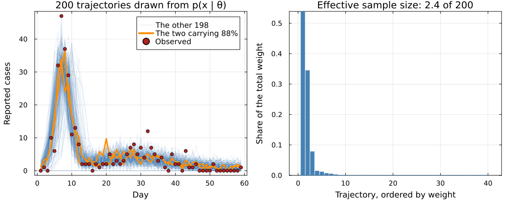{.pfwide}

Each $x_j$ is simulated **blind**, so passing near all 59 observations at once is
vanishingly rare.

## Lucky once, not fifty-nine times

A blind trajectory has to match the data on **all 59 days at once**. One day is
easy; fifty-nine in a row is not, and that is the collapse you just saw.

. . .

So stop asking for it. Score the particles one day at a time, and at the end of
each day throw away the ones the data have ruled out.

. . .

Every day then starts from trajectories that are still plausible, so the model is
only ever asked to be lucky **once**.

## One factor per observation

The likelihood already breaks into one-day-ahead forecasts:

$$p(y \mid \theta) = p(y_1 \mid \theta)\; p(y_2 \mid y_1, \theta) \cdots
p(y_T \mid y_{1:T-1}, \theta)$$

Each factor asks the same question: *given everything so far, how well did the
model predict today?*

. . .

The particles are our ensemble of guesses about where the epidemic actually is.

## Score first, prune second {.smaller}

Each day:

1. propagate every particle one day
2. weight it by how well it predicted today, $w_{t,j} = p(y_t \mid x_{t,j}, \theta)$
3. average those weights — that is today's factor
4. resample in proportion to $w_{t,j}$, and go again

$$\hat{p}(y \mid \theta) = \prod_{t} \frac{1}{J}\sum_{j=1}^{J} w_{t,j}$$

. . .

Step 3 averages over **all** $J$ particles, including the ones step 4 is about to
discard. Pruning decides where tomorrow starts; it does not change what today
scored. So keeping only the good particles cannot inflate the likelihood.

. . .

This is **sequential Monte Carlo**, better known as **particle filtering**.

# The particle filter

## The algorithm

::: {.r-stack}
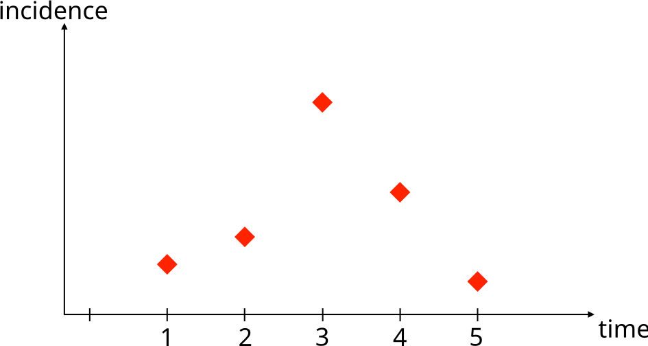{.pfwide .fragment .fade-out fragment-index=1}
{.pfwide .fragment .current-visible fragment-index=1}
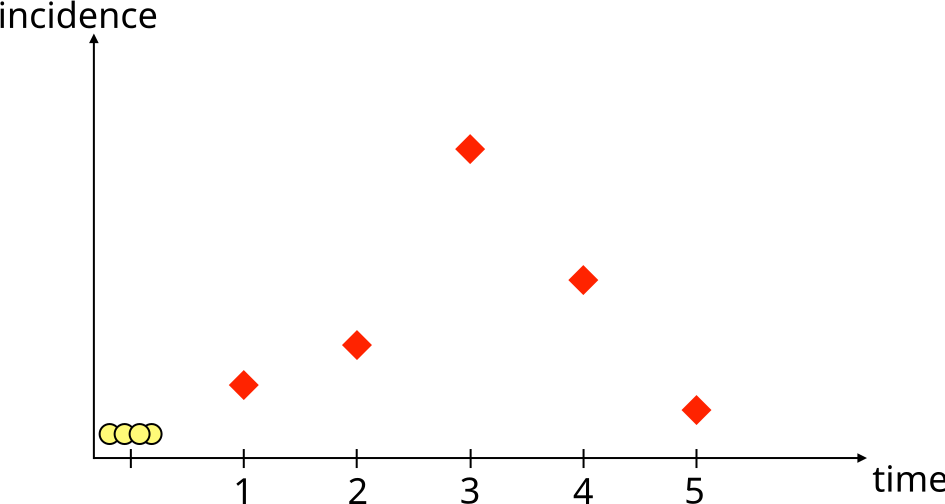{.pfwide .fragment .current-visible fragment-index=2}
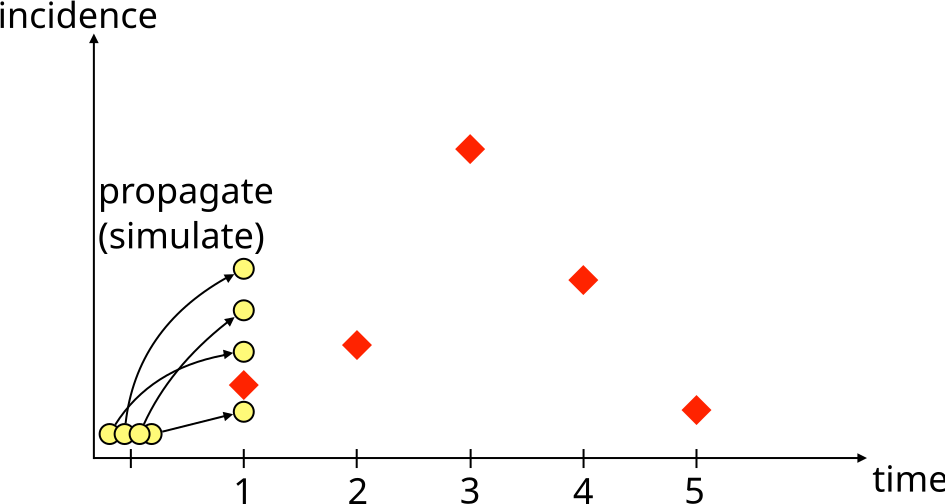{.pfwide .fragment .current-visible fragment-index=3}
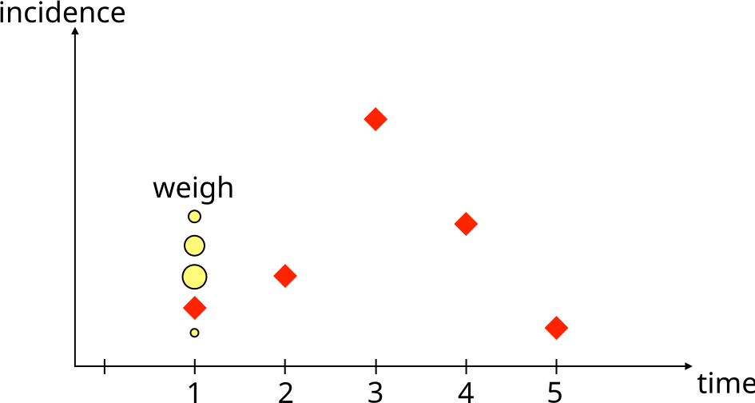{.pfwide .fragment .current-visible fragment-index=4}
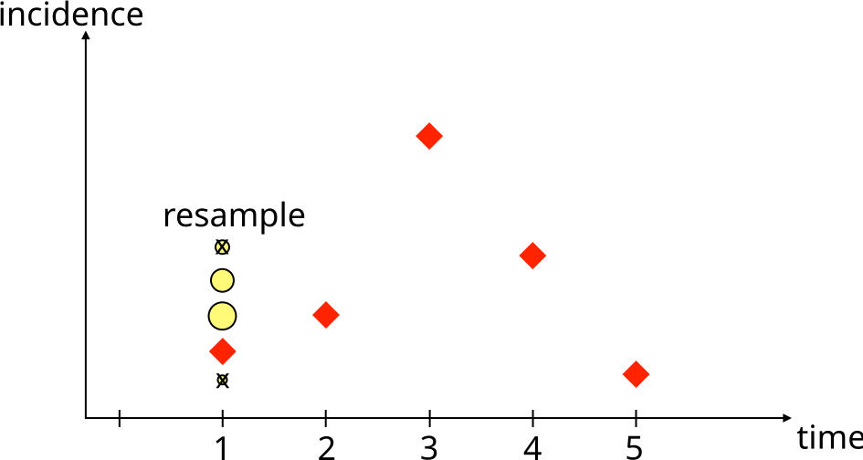{.pfwide .fragment .current-visible fragment-index=5}
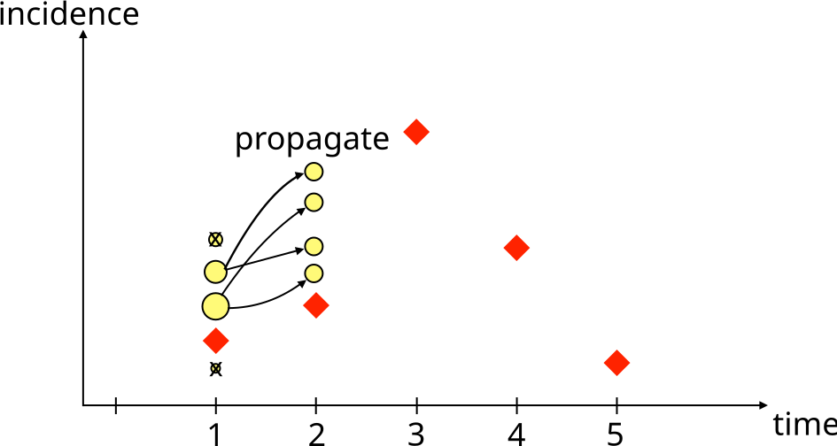{.pfwide .fragment .current-visible fragment-index=6}
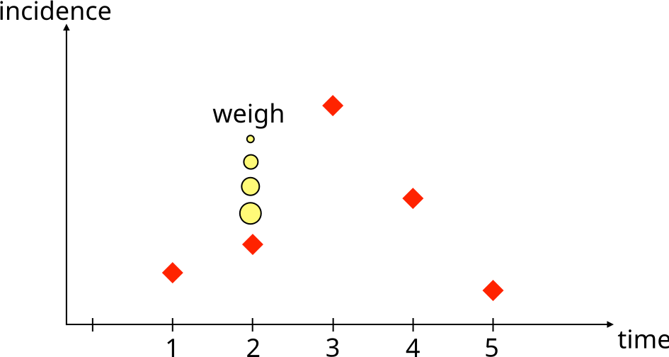{.pfwide .fragment .current-visible fragment-index=7}
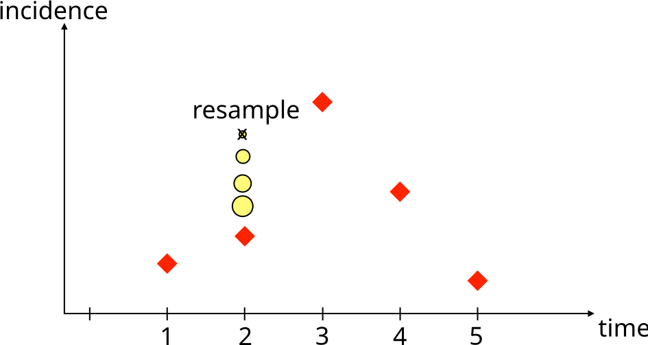{.pfwide .fragment .current-visible fragment-index=8}
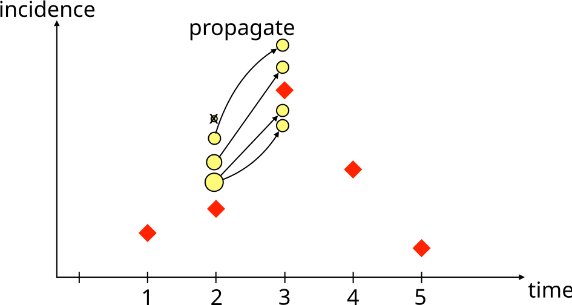{.pfwide .fragment .current-visible fragment-index=9}
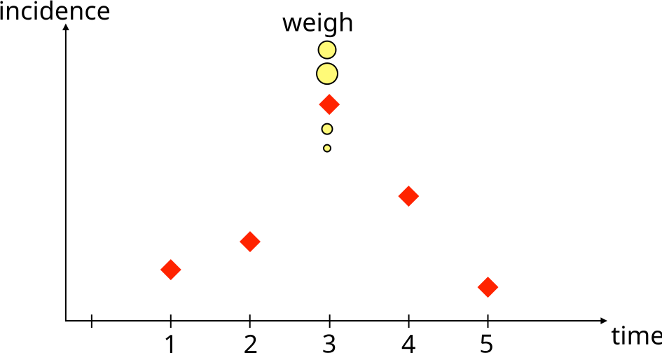{.pfwide .fragment .current-visible fragment-index=10}
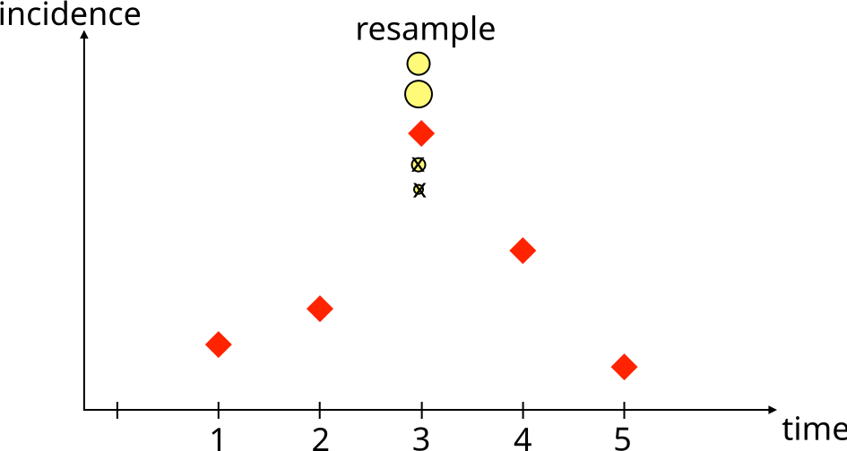{.pfwide .fragment .current-visible fragment-index=11}
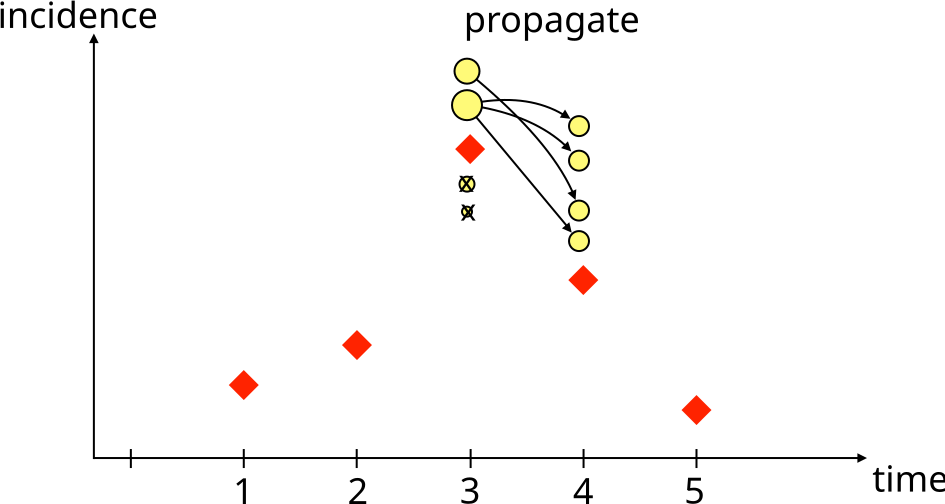{.pfwide .fragment .current-visible fragment-index=12}
{.pfwide .fragment .current-visible fragment-index=13}
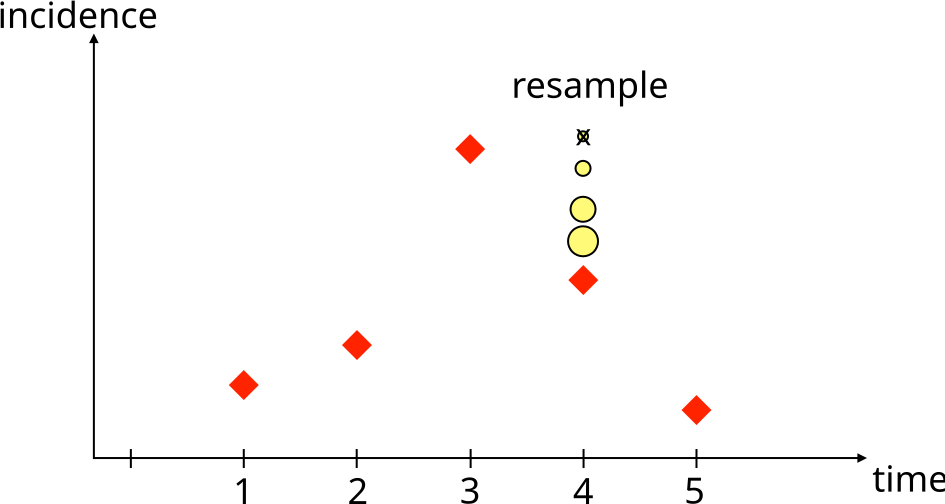{.pfwide .fragment .current-visible fragment-index=14}
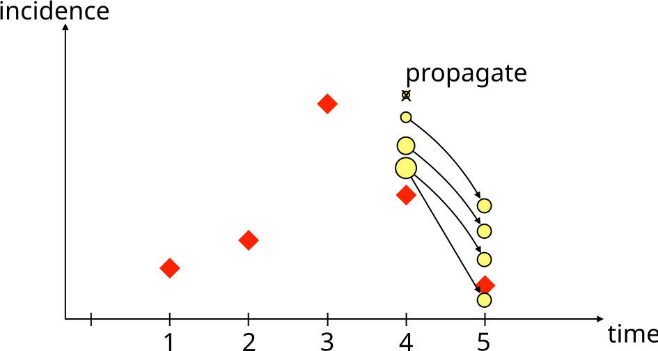{.pfwide .fragment .current-visible fragment-index=15}
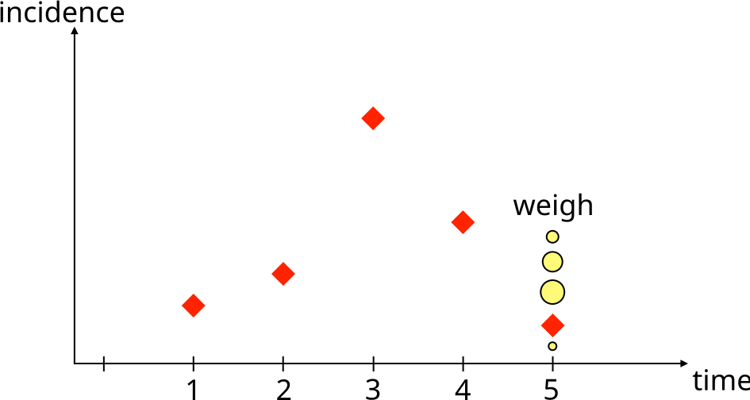{.pfwide .fragment .current-visible fragment-index=16}
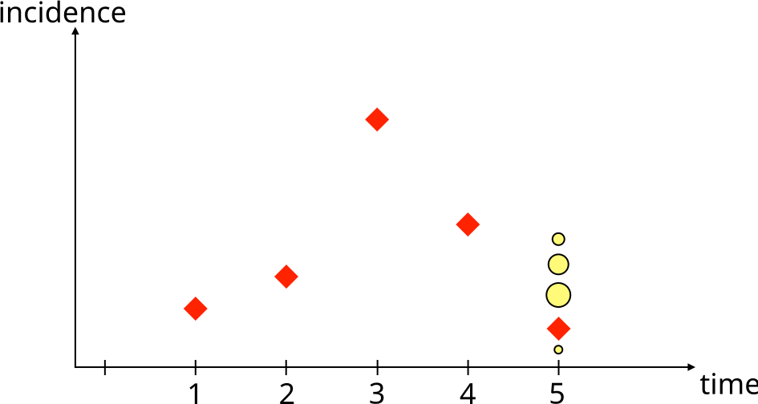{.pfwide .fragment .current-visible fragment-index=17}
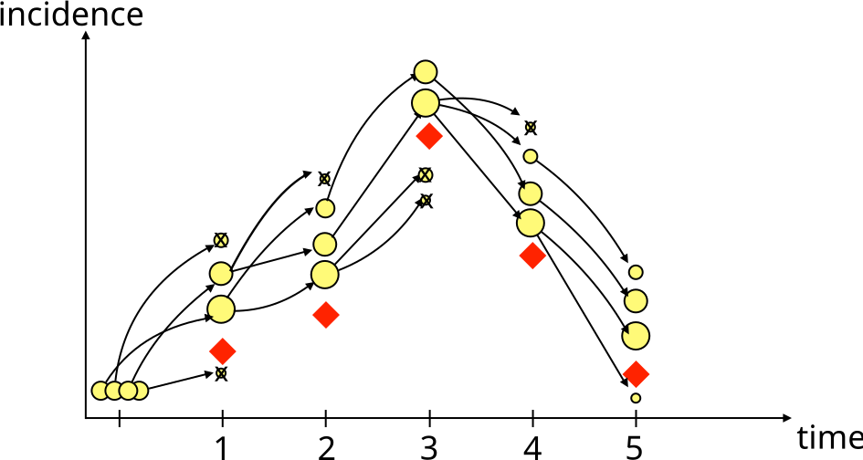{.pfwide .fragment fragment-index=18}
:::

::: {.r-stack}
[[**Initialise**]{.alert} $x_0 \sim p(x_0 \mid \theta), \quad w_0 = 1/J$]{.fragment .current-visible fragment-index=2}
[[**Propagate**]{.alert} $x_1 \sim p(x_1 \mid x_0, \theta)$]{.fragment .current-visible fragment-index=3}
[[**Weight**]{.alert} $w_1 = p(y_1 \mid x_1, \theta)$]{.fragment .current-visible fragment-index=4}
[[**Resample**]{.alert} in proportion to $w_1$]{.fragment .current-visible fragment-index=5}
[[**Propagate**]{.alert} $x_2 \sim p(x_2 \mid x_1, \theta)$]{.fragment .current-visible fragment-index=6}
[[**Weight**]{.alert} $w_2 = p(y_2 \mid x_2, \theta)$]{.fragment .current-visible fragment-index=7}
[[**Resample**]{.alert} in proportion to $w_2$]{.fragment .current-visible fragment-index=8}
[[**Propagate**]{.alert} $x_3 \sim p(x_3 \mid x_2, \theta)$]{.fragment .current-visible fragment-index=9}
[[**Weight**]{.alert} $w_3 = p(y_3 \mid x_3, \theta)$]{.fragment .current-visible fragment-index=10}
[[**Resample**]{.alert} in proportion to $w_3$]{.fragment .current-visible fragment-index=11}
[[**Propagate**]{.alert} $x_4 \sim p(x_4 \mid x_3, \theta)$]{.fragment .current-visible fragment-index=12}
[[**Weight**]{.alert} $w_4 = p(y_4 \mid x_4, \theta)$]{.fragment .current-visible fragment-index=13}
[[**Resample**]{.alert} in proportion to $w_4$]{.fragment .current-visible fragment-index=14}
[[**Propagate**]{.alert} $x_5 \sim p(x_5 \mid x_4, \theta)$]{.fragment .current-visible fragment-index=15}
[[**Weight**]{.alert} $w_5 = p(y_5 \mid x_5, \theta)$]{.fragment .current-visible fragment-index=16}
[[**Resample**]{.alert} in proportion to $w_5$]{.fragment .current-visible fragment-index=17}
[$\hat{p}(y \mid \theta) = \prod_{t} \frac{1}{J}\sum_{j} w_{t,j}$]{.fragment fragment-index=18}
:::

::: {.cite}
Four particles here. Red diamonds are the data, yellow circles the particles,
sized by weight, struck through when nobody resampled them.
:::

## Why resample?

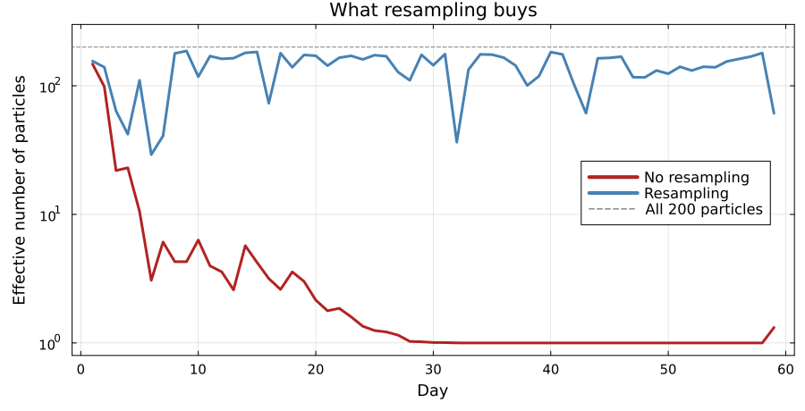{.pfwide}

Without resampling the 200 particles are worth an effective 6 by day 10 and
exactly 1 from day 30 on: one trajectory, carrying the whole estimate.

. . .

This is **particle degeneracy**, and it is the central practical problem.
Resampling concentrates effort where the data say the trajectory actually went.

. . .

The cost is **depletion**: repeatedly copying survivors means the particles
share ancestry, so diversity falls over time.

## How many particles?

- Too few and the likelihood estimate is noisy, which will wreck the sampler
  that uses it.
- Too many and every likelihood evaluation becomes expensive.

. . .

The likelihood estimate is **unbiased** but **stochastic**: run it twice with
the same $\theta$ and you get two different numbers.

. . .

Tune $J$ against the spread of $\log \hat{p}$ at a representative $\theta$, near
the posterior mode. Too noisy and the chain sticks for long stretches on a lucky
estimate; too precise and you are buying particles rather than mixing. You
measure it in the practical.

## The whole thing, in code {.smaller .scrollable}

```julia
function bootstrap_filter(rng, θ, obs, n_particles; init_state)
    particles = [copy(init_state) for _ in 1:n_particles]
    loglik = 0.0

    for y in obs
        ## propagate: run every particle forward one day
        incidence = map(1:n_particles) do i
            particles[i], daily = gillespie_step(rng, particles[i], θ)
            daily
        end

        ## weight: how plausible is today's observation under each particle?
        log_w = logpdf.(Poisson.(θ[:ρ] .* incidence), y)

        ## accumulate: the mean weight estimates today's likelihood
        loglik += logsumexp(log_w) - log(n_particles)

        ## resample: keep the particles that explained the data
        w = exp.(log_w .- maximum(log_w))
        particles = particles[rand(rng, Categorical(w ./ sum(w)), n_particles)]
    end

    return loglik
end
```

Four steps, one loop. In the practical you read this one line by line, then swap
it for the bootstrap filter in `GeneralisedFilters.jl` behind the same interface.

##  Your Turn {background-color="#447099" transition="fade-in"}

In the practical you will

- see why a deterministic likelihood fails for a stochastic model
- watch particles propagate, get weighted, and be resampled
- read that filter line by line and work out what each step does
- explore how the number of particles affects the likelihood estimate


#

[Return to the session](../particle_filters.qmd)
